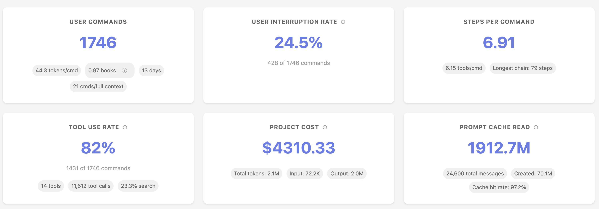
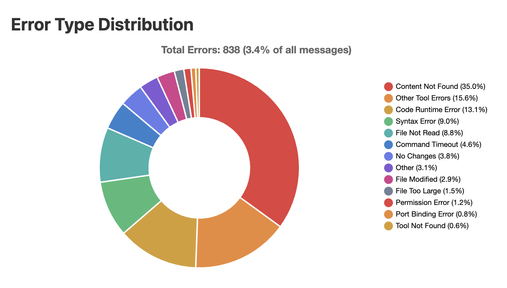
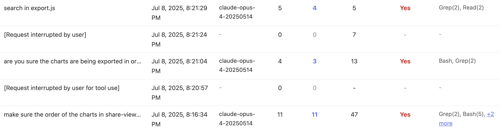

# Sniffly - Claude Code Analytics Dashboard

Analyze Claude Code logs to help you use Claude Code better.

## 🚀 Quickstart
- Requirement: Python 3.10+

### With UV (recommended)
Make sure you have `uv` installed! https://github.com/astral-sh/uv

```bash
# One-time execution (no installation needed)
uvx sniffly@latest init
```

```bash
# Install the package
uv tool install sniffly@latest
sniffly init
```

After running `sniffly init`, access your dashboard at http://localhost:8081 (or whichever port you choose).

### With pip

```bash
pip install sniffly
sniffly init
```

### From source
```bash
git clone https://github.com/chiphuyen/sniffly.git
cd sniffly
pip install -e .
sniffly init
```


## 📊 Features
### Understanding your usage patterns
<center>

</center>

### Error breakdown
_See where Claude Code makes mistakes so that you avoid these mistakes._

<center>

</center>

### Message history analysis
_Walk through all your instructions and share them with your coworkers if needed._

<center>

</center>

## 🔧 Configuration

### Common Settings

```bash
# Change port (default: 8081)
sniffly config set port 8090

# Disable auto-opening browser
sniffly config set auto_browser false

# Show current configuration
sniffly config show
```

### All Configuration Options

| Key | Default | Description |
|-----|---------|-------------|
| `port` | 8081 | Server port |
| `host` | 127.0.0.1 | Server host |
| `auto_browser` | true | Auto-open browser on start |
| `cache_max_projects` | 5 | Max projects in memory cache |
| `cache_max_mb_per_project` | 500 | Max MB per project |
| `messages_initial_load` | 500 | Initial messages to load |
| `max_date_range_days` | 30 | Max days for date range selection |

See full [CLI Reference](docs/cli-reference.md) for all options and commands.


## 💡 Sharing Your Dashboard

1. Click the "📤 Share" button in your dashboard
2. Choose privacy options:
   - **Private**: Only people with the link can view
   - **Public**: Listed in the public gallery
   - **Include Commands**: Share your actual command text
3. Copy and share the generated link

## 🚨 Troubleshooting

### Common Issues

```bash
sniffly help
```

**Port already in use?**
```bash
# Use a different port
sniffly init --port 8090

# Or change default
sniffly config set port 8090
```

**Browser doesn't open?**
```bash
# Check setting
sniffly config show

# Enable auto-browser
sniffly config set auto_browser true

# Or manually visit http://localhost:8081
```

**Configuration issues?**
```bash
# View all settings and their sources
sniffly config show

# Reset a setting to default
sniffly config unset port

# Remove all custom config
rm ~/.sniffly/config.json
```

For more issues, see [GitHub Issues](https://github.com/chiphuyen/sniffly/issues).

## 🔐 Privacy

Sniffly runs entirely on your local machine:
- ✅ All data processing happens locally
- ✅ No telemetry
- ✅ Your conversations never leave your computer
- ✅ Shared dashboards are opt-in only

## 📄 License

MIT License - see [LICENSE](LICENSE) file.

## 🔗 Links

- **Homepage**: [sniffly.dev](https://sniffly.dev)
- **Documentation**: [Full CLI Reference](docs/cli-reference.md)
- **Issues**: [GitHub Issues](https://github.com/chiphuyen/sniffly/issues)
